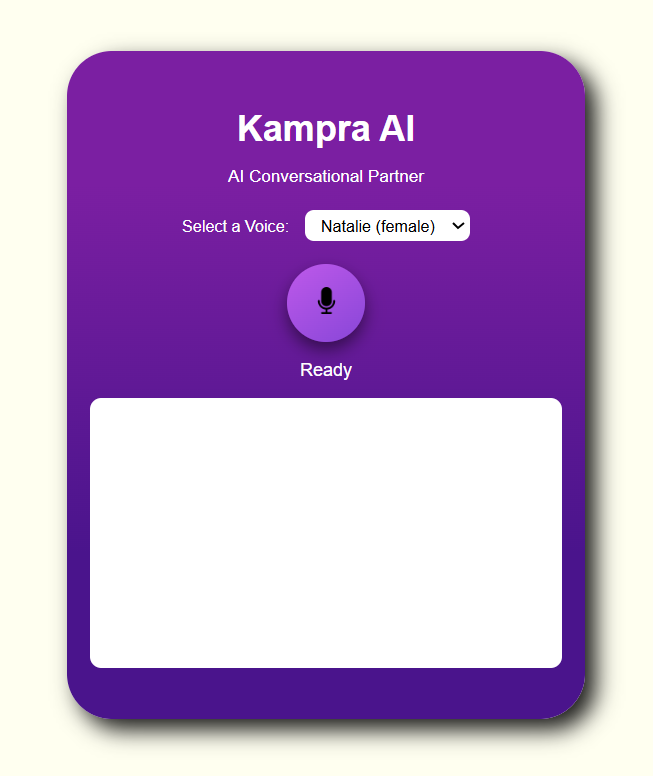

# 🎙 Murf AI Voice Agent Challenge 
# Kampra AI 


**Kampra AI** is an interactive voice-based conversational agent built using **Murf AI**, **Gemini API**, and **AssemblyAI**, powered by a Flask backend and a sleek web UI.
It listens to your voice, understands your intent, and responds back with natural, human-like speech — all in real time.

---

## 📌 Key Highlights

🎤 **Speech-to-Text (STT)**: Converts your speech into text using **AssemblyAI**

🤖 **AI-Powered Conversations**: Generates smart, context-aware responses via **Google Gemini API**

🗣 **Text-to-Speech (TTS)**: Speaks responses aloud using **Murf AI’s high-quality voices**

🎨 **Premium UI**: Clean, responsive interface with animated record button

🔄 **Seamless Flow**: Automatic audio playback without needing manual clicks

⚡ **Single Dynamic Button**: **Start/stop** recording with one button that updates in real time

---

## 🏗 Technology Stack

- **Frontend**: HTML, CSS, JavaScript
- **Backend**: Python, Flask
- **APIs**:
  - Murf AI (Text-to-Speech)
  - AssemblyAI (Speech-to-Text)
  - Google Gemini (LLM for conversation)
---

## 🖼 Architecture Overview

**User speaks** → Audio recorded in browser

**Speech-to-Text (STT)** → Sent to AssemblyAI for transcription

**AI Response** → Gemini API processes transcription and generates a reply

**Text-to-Speech (TTS)** → Murf AI converts reply into speech

**Audio Playback** → Plays automatically in the browser

---

## 📂 Project Structure

```
├── AI-Voice-Agent-Challenge           # Project Root
│   📂 main.py                         # Backend Logic (Flask App)
|   📂 static                          # Static Assets (JS/CSS)
│   ├── script.js                      # Frontend Logic (JavaScript)
│   ├── style.css                     # Styling (CSS)
|   📂 templates                      # TML Templates Folder
│   ├── index1.html                   # Main UI Page
|   📂 .env                           # nvironment Variables (API Keys)
|   📂 requirements.txt               # Python Dependencies
|   📂 README.md                      # Project Overview & Instructions
```
---

## 🗓️ Day 1 – Setup, Strategy & First Steps

🚀 Joined the Murf AI Voice Agent Challenge

🎯 Explored project goals and tools

🛠️ Set up base project using Flask

🔐 Registered and tested Murf API

🔊 Generated first TTS audio

---

## 🗓️ Day 2 – Integrating Text-to-Speech API

🔗 Connected Murf’s TTS API with Flask backend

🧑‍💻 Built a simple UI with text input and audio playback

🔄 Completed full text-to-speech cycle in browser

⚠️ Implemented basic error handling

📢 Shared progress on LinkedIn

---

## 🗓️ Day 3 – Voice Agent UX

🎨 Improved UI using HTML/CSS

🧪 Refined API flow for smoother interactions

🗣️ Enhanced voice interaction for a natural feel

🙌 Publicly acknowledged Murf AI for their tools

---

## 🗓️ Day 4 – Echo Bot

✨ Introduced "Echo Bot" feature

🎙️ Integrated MediaRecorder API for mic input

🎧 Enabled real-time recording and playback in browser

🧱 Laid foundation for speech input handling

---

## 🗓️ Day 5 – Audio Upload & Server Integration

☁️ Enabled audio uploads to Flask backend

🛣️ Created /upload endpoint to store audio files

🗂️ Returned metadata (name, type, size) to UI

📟 Added upload status messages and feedback

🔁 Connected mic → server → playback workflow

---

## 🗓️ Day 6 – Transcription Integration

🧵 Built /transcribe/file API for voice-to-text

🧠 Integrated AssemblyAI for transcription

🖥️ Displayed transcribed text in UI

🔁 Enabled full record → upload → transcribe flow

---

## 🗓️ Day 7 – Voice-to-Voice with /tts/echo

🆕 Developed /tts/echo for audio-to-audio interaction

🔄 Flow: Audio input → transcription → Murf TTS → audio output

✅ Delivered fully automated voice-to-voice exchange

---

## 🗓️ Day 8 – Deploying LLM Query Endpoint

🧠 Created /llm/query to handle text-based AI queries

⚡ Integrated Gemini API (gemini-1.5-flash) for fast responses

🧼 Built helper function for clean code

🚫 Added robust error handling for LLM requests

---

## 🗓️ Day 9 – Audio-to-Audio AI Conversation

🎤 Extended LLM flow to support voice input

🔁 Flow: Record → transcribe → LLM → TTS → reply

🗣️ Enabled natural audio conversations without text

🔊 Voice plays instantly after processing

---

## 🗓️ Day 10 – Session-Based Chat Memory

🧠 Implemented contextual memory using session_id

💬 Stored chat history and passed it to Gemini

🧾 Enabled back-and-forth context-aware conversations

🎯 Maintained full voice interaction loop

---

## 🗓️ Day 11 – Strengthening Error Handling

🛡️ Strengthened backend with try/except blocks

⚠️ Enhanced frontend with user-friendly error messages

📉 Reduced crash points and improved stability

🤝 Delivered a more reliable user experience

---

## 🗓️ Day 12 – Finalizing UI and User Interaction

🧼 Revamped UI for better usability and aesthetics

🎙️ Added one-tap recording, animated mic button

🔊 Enabled auto-play for AI voice replies

📱 Ensured mobile responsiveness

Removed unnecessary elements for a cleaner interface

---

## 📸 Screenshots
  
🚀 The voice agent now functions like a fully-fledged app, moving beyond just a prototype.

---

## 🗝️ API Keys

Create a .env file in the project root and set the following:


```env
MURF_API_KEY = your_murf_api_key
ASSEMBLYAI_API_KEY = your_assemblyai_api_key
GEMINI_API_KEY = your_gemini_api_key
```
---

## ⚙️ Setup & Installation


1️⃣ Clone the Repository
```
git clone https://github.com/AsmiRaut23/Murf-AI-Voice-Agent.git
cd Murf-AI-Voice-Agent
```

2️⃣ Create and activate virtual environment
Windows
```
python -m venv .venv
.venv\Scripts\activate
```

4️⃣ Install Dependencies


```
pip install -r requirements.txt
```

5️⃣ Run the Flask Server

```
python app.py
```
Server will start at: **http://127.0.0.1:5000**

---

## 🙌 Heartfelt Appreciation

A big thank you to Murf AI for organizing this inspiring challenge and empowering creators to dive into the world of voice-first interfaces.
Your innovative tools are driving the future of interactive AI agents — truly appreciated!


